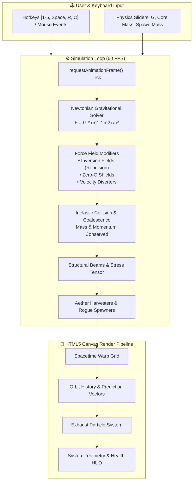

# ⚛️ AetherEngine: Orbit Collapse

> A deterministic 2D Newtonian gravity physics sandbox and orbital mechanics simulation engine built with modern HTML5 Canvas and modular JavaScript.

[](LICENSE)


---

## 🌟 Overview

**AetherEngine: Orbit Collapse** is an interactive, browser-native computational physics simulation that models $N$-body gravitational interactions, planetary orbital stability, and momentum-conserving celestial collisions. Designed with a modular architecture, the engine isolates vector mathematics, physics solvers, kinetic emitters, and canvas rendering into decoupled modules.

The engine includes a full **headless test suite** with 35 deterministic unit assertions verifying orbital decay, conservation of linear momentum, and celestial mechanics.

---

## 🏗️ Architecture & Physics Pipeline



---

## 🚀 Key Features

- **🪐 Deterministic Newtonian Gravity Solver**:
  - Simulates dynamic gravitational pull based on Newton's law of universal gravitation ($F = G \frac{m_1 m_2}{r^2}$).
  - Real-time orbital velocity calculation enabling stable, circular, and eccentric planetary orbits.
- **💥 Inelastic Collision Dynamics**:
  - Implements realistic celestial merging where colliding asteroids combine mass and conserve center of mass and momentum ($v_{new} = \frac{m_1 v_1 + m_2 v_2}{m_1 + m_2}$).
- **🛡️ Force Field Modifiers**:
  - **Inversion Fields**: Generates anti-gravitational repulsion vectors away from gravitational centers.
  - **Zero-G Shields**: Neutralizes gravitational acceleration within defined spatial boundaries.
  - **Velocity Diverters**: Deflects incoming kinetic bodies tangentially while conserving velocity magnitude.
  - **Mining Lasers & Harvesters**: Siphons mass from orbiting bodies to generate energy and fuel resources.
- **🎨 Cyberpunk / Sci-Fi HUD Canvas Renderer**:
  - Real-time velocity vectors, trajectory prediction trails, particle emission exhausts, and glowing celestial bodies.
- **🧪 Headless Test Suite (35/35 Passing)**:
  - Automated mathematical and physical verification including circular orbit eccentricity ($\le 0.06\%$), momentum conservation, and stress tensor limits.

---

## ⌨️ Controls & Keyboard Shortcuts

| Shortcut | Action | Description |
| :--- | :--- | :--- |
| `Space` | **Pause / Resume** | Freezes simulation time without resetting state |
| `R` | **Restart** | Re-initializes celestial bodies and sector telemetry |
| `C` | **Clear Asteroids** | Removes all dynamic bodies from the canvas |
| `1` | **Fling Asteroid** | Click-and-drag to aim and launch celestial projectile |
| `2` | **Inversion Field** | Click to deploy localized anti-gravity repulsion zone |
| `3` | **Zero-G Shield** | Click to place an inertia-dampening gravitational barrier |
| `4` | **Diverter** | Click to deploy a tangential velocity deflector |
| `5` | **Structural Beam**| Click two asteroids to link them with a stress-bearing spring |
| `Right Click` | **Recycle / Delete** | Removes hovered asteroid or emitter |

---

## 📁 Repository Structure

```text
AetherEngine/
├── index.html           # Sci-Fi HUD control interface & simulation viewport
├── style.css            # Cyber-themed styling & telemetry design system
├── test.mjs             # Headless automated unit test runner (Node.js)
├── LICENSE              # MIT License
├── CONTRIBUTING.md      # Contribution & PR guidelines
├── .github/             # GitHub issue templates
├── js/
│   ├── vector.js        # 2D Euclidean Vector math library
│   ├── asteroid.js      # Celestial body state & mass representation
│   ├── emitter.js       # Core particle generator & depletion logic
│   ├── physics.js       # Gravitational math, collision solver & force fields
│   ├── renderer.js      # High-performance HTML5 Canvas graphics engine
│   ├── ui.js            # HUD interactive sliders & tool event listeners
│   ├── test-runner.js   # In-browser test execution harness
│   └── main.js          # Engine lifecycle loop & initialization
└── README.md            # Engine documentation
```

---

## 🏃 Getting Started

### 1. Instant Run in Browser
Simply open `index.html` in any modern web browser or serve via any static file server:

```bash
# Using Python static server
python -m http.server 3000

# Or using Node.js npx serve
npx serve .
```

Navigate to `http://localhost:3000` to interact with the physics controls, spawn celestial bodies, and manipulate gravitational fields.

### 2. Running Headless Verification Tests

Run the standalone verification suite without browser dependencies:

```bash
node test.mjs
```

**Test Output:**
```text
=========================================
  AETHERENGINE: RUNNING HEADLESS TESTS   
=========================================

[PASS] Vector magnitude calculation correct (3,4 -> 5)
[PASS] Vector static addition correct
[PASS] Vector instance addition correct
[PASS] Vector normalization results in unit vector
[PASS] Orbital velocity calculation matches theoretical: 15.767 vs 15.767
[PASS] Orbit remains stable and circular: Max distance deviation is 0.13px (0.06% eccentricity)
[PASS] Asteroids merged successfully into 1 body
[PASS] Merged mass is conserved: 400 (expected 400)
[PASS] Momentum conserved: post-collision velocity is -2.5 (expected -2.5)
...
=========================================
TEST RUN COMPLETE. Passed: 35, Failed: 0
=========================================
```

---

## 📜 License

MIT License &copy; 2026 Rohan Khadke. Free to use, adapt, and build upon. See [LICENSE](LICENSE) for details.
